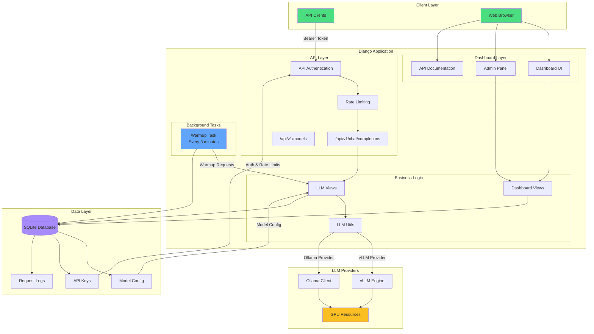

# CHUNGUS

**Computing Hybrid Utilization Network for GPU Unified Scheduling**

A high-performance personal computing infrastructure designed for advanced GPU workload management and distributed processing. CHUNGUS provides intelligent resource allocation, real-time monitoring, and seamless coordination across multiple GPU units for optimal computational efficiency.

## Features

### 🚀 LLM Hosting
- Dedicated infrastructure for hosting and serving large language models
- Optimized inference pipelines with dynamic memory allocation
- Support for multiple concurrent model deployments
- Advanced batching and quantization techniques
- Low-latency response times for real-time applications

### 🧬 Protein Folding
- Specialized computational pipelines for protein structure prediction
- GPU-accelerated molecular dynamics simulations
- Distributed folding calculations across multiple GPUs
- Integration with Folding@Home

### ⚙️ Intelligent Scheduling
- Unified scheduling framework for dynamic GPU resource allocation
- Priority-based queuing and workload-aware resource allocation
- Predictive load balancing to maximize GPU utilization
- Real-time monitoring and adaptive scheduling

### 🔌 OpenAI-Compatible API
- Full OpenAI API compatibility for easy integration
- Support for both streaming and non-streaming responses
- Rate limiting and API key management
- Comprehensive request logging and analytics

## Architecture

CHUNGUS is built on Django and supports multiple LLM providers:

- **vLLM**: High-performance inference engine for large language models
- **Ollama**: Local model serving with flexible configuration

### System Architecture Diagram



## Installation

### Prerequisites

- Python 3.13
- Poetry (for dependency management)
- CUDA-capable GPU(s) (for vLLM)
- Django 5.2.7+

### Setup

1. Clone the repository:
```bash
git clone <repository-url>
cd Chungus
```

2. Install dependencies using Poetry:
```bash
poetry install
```

3. Set up environment variables:
```bash
cp .env.example .env
# Edit .env with your configuration
```

4. Run migrations:
```bash
poetry run python manage.py migrate
```

5. Create a superuser:
```bash
poetry run python manage.py createsuperuser
```

6. Run the development server:
```bash
poetry run python manage.py runserver
```

7. Model warmup runs automatically:
   - The warmup task starts automatically when Django/Gunicorn starts
   - It runs every 3 minutes in the background
   - No additional setup required!

## Usage

### Web Interface

- **Home**: `http://localhost:8000/` - System overview and information
- **Dashboard**: `http://localhost:8000/dashboard/` - Superuser dashboard with stats and management
- **API Documentation**: `http://localhost:8000/api-docs/` - Complete API reference
- **Admin Panel**: `http://localhost:8000/admin/` - Django admin interface

### API Usage

CHUNGUS provides an OpenAI-compatible API endpoint at `/api/v1/chat/completions`.

#### Non-Streaming Request

```python
import requests

url = "http://localhost:8000/api/v1/chat/completions"
headers = {
    "Content-Type": "application/json",
    "Authorization": "Bearer YOUR_API_KEY"
}
data = {
    "model": "your-model-name",
    "messages": [
        {"role": "user", "content": "Hello!"}
    ],
    "temperature": 0.7,
    "max_tokens": 512
}

response = requests.post(url, headers=headers, json=data)
result = response.json()
print(result["choices"][0]["message"]["content"])
```

#### Streaming Request

```python
import requests
import json

url = "http://localhost:8000/api/v1/chat/completions"
headers = {
    "Content-Type": "application/json",
    "Authorization": "Bearer YOUR_API_KEY"
}
data = {
    "model": "your-model-name",
    "messages": [
        {"role": "user", "content": "Hello!"}
    ],
    "stream": True
}

response = requests.post(url, headers=headers, json=data, stream=True)

for line in response.iter_lines():
    if line:
        line = line.decode('utf-8')
        if line.startswith('data: '):
            data_str = line[6:]
            if data_str == '[DONE]':
                break
            try:
                chunk = json.loads(data_str)
                if 'choices' in chunk and len(chunk['choices']) > 0:
                    delta = chunk['choices'][0].get('delta', {})
                    if 'content' in delta:
                        print(delta['content'], end='', flush=True)
            except json.JSONDecodeError:
                continue
```

For complete API documentation, visit `/api-docs/` after starting the server.

## Configuration

### Environment Variables

Create a `.env` file in the project root:

```env
# Django Settings
SECRET_KEY=your-secret-key-here
DEBUG=True
ALLOWED_HOSTS=localhost,127.0.0.1

# HuggingFace Token (for gated models)
HF_TOKEN=your-huggingface-token

# Database (optional, defaults to SQLite)
DATABASE_URL=sqlite:///db.sqlite3
```

### Model Configuration

Models can be configured through the Django admin interface or the dashboard:

1. Navigate to `/dashboard/` (requires superuser)
2. Click "ADD MODEL"
3. Configure:
   - Model name and path
   - Provider (vLLM or Ollama)
   - Context length, temperature, max tokens
   - HuggingFace token (if needed)
   - Ollama base URL (if using Ollama)

### API Key Management

API keys can be created and managed through:

- **Dashboard**: `/dashboard/` - Visual interface for managing keys
- **Admin Panel**: `/admin/` - Django admin interface

Each API key supports:
- Rate limiting (per minute and per hour)
- Usage statistics tracking
- Active/inactive status

### Model Warmup

Models can be kept warm to avoid cold start delays. To enable warmup for a model:

1. Navigate to `/dashboard/` or `/admin/`
2. Edit the model you want to keep warm
3. Enable the "Always Warm" checkbox
4. Ensure the cron job is set up (see Setup step 7)

Models with `alwayswarm=True` will receive a simple "what is 1 + 1" request every 3 minutes to keep them loaded in memory.

## Project Structure

```
Chungus/
├── Chungus/          # Django project settings
├── Dashboard/        # Web dashboard and UI
│   ├── templates/   # HTML templates
│   ├── static/      # CSS and static files
│   ├── views.py     # View functions
│   └── api_views.py # Dashboard API endpoints
├── LLM/             # LLM API application
│   ├── models.py    # Database models (Model, APIKey, LLMRequest)
│   ├── views.py     # API endpoints
│   ├── utils.py    # vLLM and Ollama utilities
│   └── auth.py      # API key authentication
├── manage.py        # Django management script
├── pyproject.toml   # Poetry dependencies
└── README.md        # This file
```

## API Endpoints

### Chat Completions
- `POST /api/v1/chat/completions` - Generate chat completions (streaming and non-streaming)

### Models
- `GET /api/v1/models` - List available models

### Dashboard API (Superuser Only)
- `GET /api/models/` - Get all models
- `POST /api/models/create/` - Create new model
- `POST /api/models/<id>/update/` - Update model
- `POST /api/models/<id>/delete/` - Delete model
- `GET /api/keys/` - Get all API keys
- `POST /api/keys/create/` - Create new API key
- `POST /api/keys/<id>/update/` - Update API key
- `POST /api/keys/<id>/delete/` - Delete API key
- `GET /api/chart-data/` - Get chart data for dashboard

## Author

**Youwei Zhen**

- LinkedIn: [youwei-zhen](https://www.linkedin.com/in/youwei-zhen-a8b662213/)
- Personal Site: [youweizhen.com](https://youweizhen.com)
- GitHub: [antodono](https://github.com/antodono)
